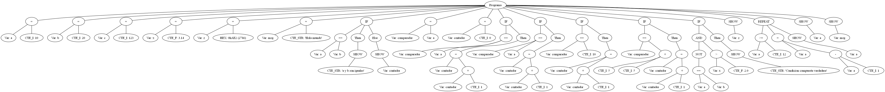

# Trabajos para la materia COMPILADORES
> Para la Licenciatura en Sistemas de Información de la Universidad Nacional de Luján

### Integrantes: 
* Thiago Puyelli
* Bautista Pereyra Buch
* Matias Herneder

# Generacion de codigo intermedio

## Para generar el AST

-> Hacer doble click para correrlo o ejecutar: ```java -jar AnalizadorAST.jar```

## Ejemplo de prueba
Con el siguiente codigo de ejemplo:

```
PROGRAM.SECTION

/* Declaraciones de variables */
DECVAR
  INT a, b, w, x, e, f
ENDDECVAR

// Inicializaciones / asignaciones
a = 10
b = 20
e = 123
x = 3
f = 5

show #Iguales( a + w/b, [x, e, f] )


ENDPROGRAM.SECTION
```

Obtuvimos el siguiente arbol:
